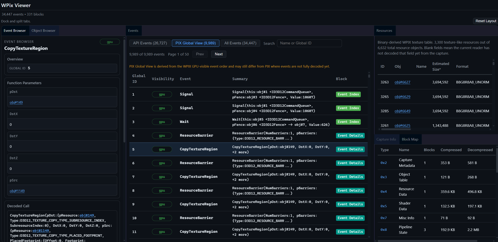

# WPIX Viewer

Browser-based viewer for `.wpix` GPU capture files.



It opens a WPIX file directly in the browser and shows:

- capture metadata
- block map
- binary-derived resource table
- decoded event stream with PIX-style global ordering
- event and object browsers with cross-linked references

## Warning

- WPIX Viewer still has gaps in opcode coverage, compact PIX payload decoding, and record-family naming.
- Some fields are inferred from surrounding state instead of being proven from a single record.
- The viewer may misdecode records, omit fields, or label unknown fields too conservatively.

Treat this project as a baseline for your own custom tooling, not a standalone ready-to-use application.

Feel free to contribute changes if you find something missing!

## Project Layout

- [app](app/)
  - web app
- [docs](docs/)
  - references and notes

## Run

Serve the repository and open `/app/`.

Example with Python:

```powershell
python -m http.server 4173
```

Then open:

```text
http://localhost:4173/app/
```

## Usage

1. Open the app.
2. Drop a `.wpix` file onto the page.
3. Inspect:
   - `Capture Info`
   - `Block Map`
   - `Resources`
   - `Events`
   - `Event Browser`
   - `Object Browser`

The events table supports:

- PIX Global View
- API-only view
- all-events view
- search by event name or Global ID

## Notes

- The app reads arbitrary `.wpix` files directly.
- Public docs are kept under [docs](docs/).
- This project was NOT built by disassembling or decompiling any closed-source software, including Microsoft PIX. It is based on public references and direct analysis of WPIX files.
